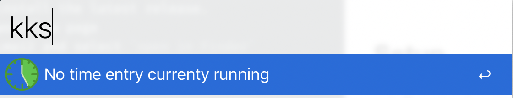
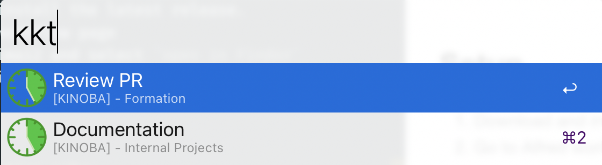

# alfred-kimai2

## Setup

1) Download and install the latest release.
2) Go to Alfred workflow page
3) Right click Kimai2 and select `open in Finder`
4) Create or modify the .env to your needs

Example of .env:

```
{
  "api_url":"https://kimai.org/api",
  "auth_user":"user@email.com",
  "auth_token":"generated_token"
}
```

## Usage

### View current time entry



### View recent time entries



## Todo

- [ ] Configure authentication from Alfred with `kko`
- [ ] Start a new time entry
- [ ] Write tests
- [ ] Use Github Actions to automate tests
